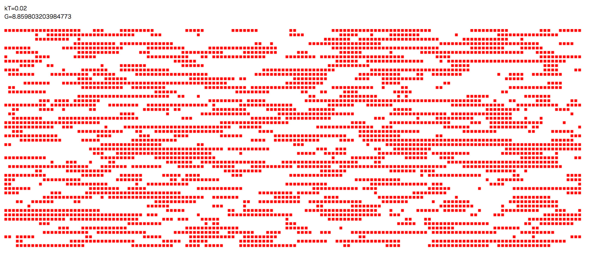
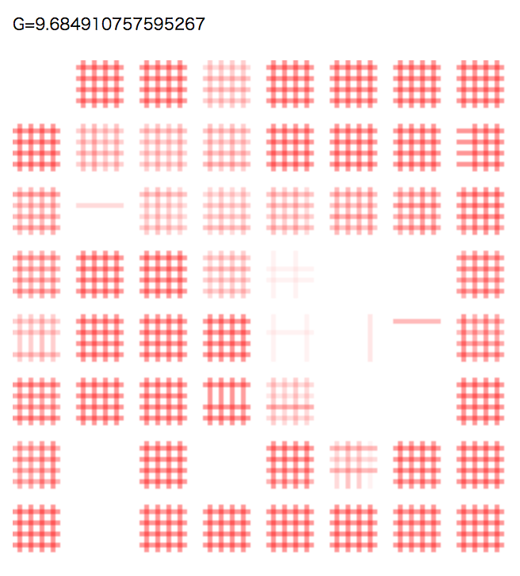
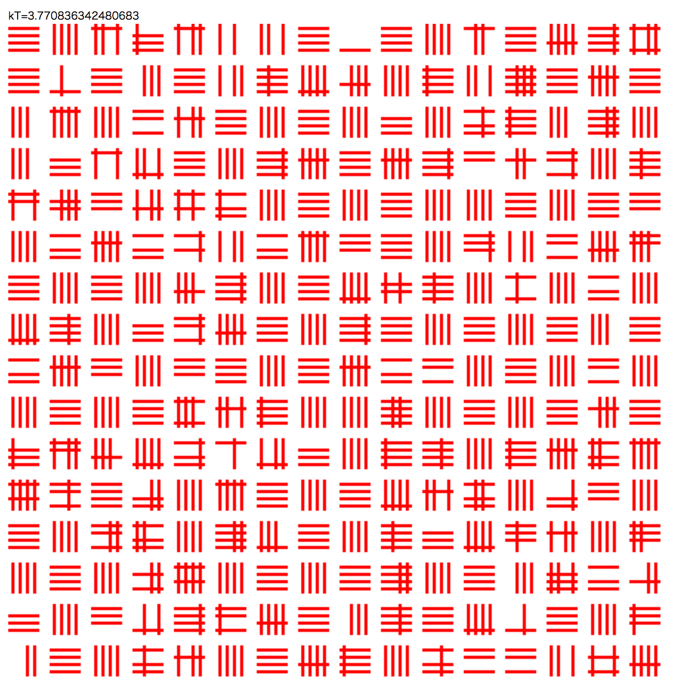

# Simulated Quantum Annealing & Simulated Annealing Simulator on Javascript 

We have 3 files.  
core.js - core file of simulated quantum annealing simulator  
core_chimera_sa.js
core_chimera_qa.js

we also have example html file using canvas to simulate sqa  
example/sqa_canvas.html  
  

SQA version needs heavy calculation power because parallely caculating many trotters.
And this example is drawing the first 10 trotter of 256 trotter slices.

SA version is much more lighter because we only have 1 process of calculation.

